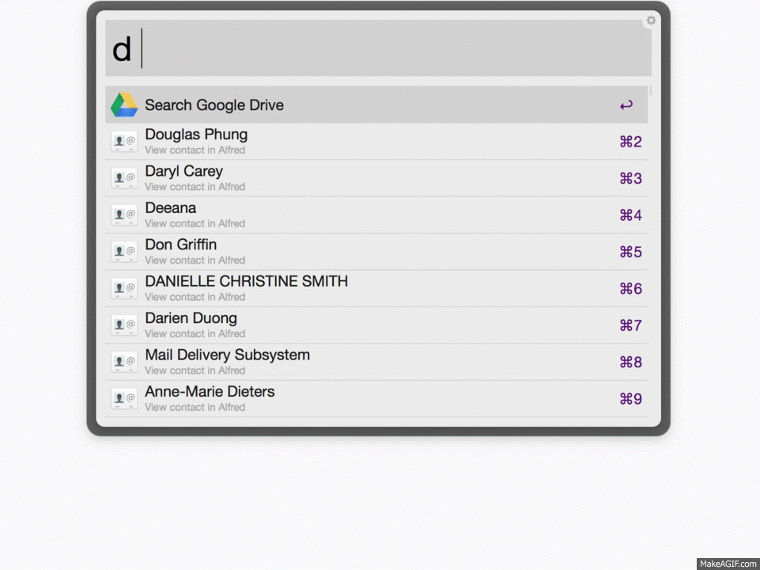

# Google Drive Workflow for [Alfred](http://www.alfredapp.com/)

This workflow searches your Google Drive and will open selected files in your browser. The keyword is `d` (example `d alfred`).

With <kbd>↩</kbd> you can open the entry in your default browser.

With <kbd>⌘C</kbd> you can copy the link to your clipboard.

**Please leave issues if you encounter any problems or star this repo if you found it useful :)**

[Download](https://github.com/azai91/alfred-drive-workflow/releases/latest)

## Getting Started

The first time you use this workflow, you will be asked (in your default browser) to allow “Alfred Drive Workflow” to view and manage files in your Google Drive.

After successfully connecting the workflow to your Google Drive you can search it from Alfred using `d {query}`.

## Commands

- `d {query}`
Search your Google Drive for files that match the query. You can open the file in your default browser by selecting the file and hitting `enter`

- `d New Document {name}`
Create a new Google Document and open it in your default browser. Name is optional and defaults to `Untitled`.

- `d New Spreadsheet {name}`
Create a Google Spreadsheet and opens it in your default browser. Name is optional and defaults to `Untitled`.

- `d New Presentation {name}`
Create a Google Presentation (slide) and opens it in your default browser. Name is optional and defaults to `Untitled`.

- `d New Form {name}`
Create a Google Form and opens it in your default browser. Name is optional and defaults to `Untitled`.

- `d Update to Google Drive version 1.x`
This action is only available when there is an update. It will download the update and ask Alfred to install it.

- `d Sign out of Google Drive`
Disconnect the workflow from Google Drive and delete access tokens.

## Configuration

You can set [Workflow Environment Variable][1] to control some aspects of this workflow.

### `custom_query`

This will be `and`’ed with the query used for getting files from Google Drive. See [Searching Files](https://developers.google.com/drive/v2/web/search-parameters) for syntax, some examples:

- Exclude all folders and PDF files from search results: `mimeType != 'application/pdf' and mimeType != 'application/vnd.google-apps.folder'`
- Limit search results to items in the folder with ID `0Bx_0bq…F2N`: `'0Bx_0bq…F2N' in parents`

To find the ID of a specific folder, navigate to that folder in your web browser and should be able to see the ID in the URL.

### `open_args`

If you want to open links in a specific browser you can create a [Workflow Environment Variable][1] named `open_args` with a value of:

- Safari:  `-b com.apple.Safari`
- Firefix: `-b org.mozilla.firefox`
- Chrome:  `-b com.google.Chrome`

[1]: https://www.alfredapp.com/help/workflows/advanced/variables/

## Supported Files Types

- Google Docs
- Google Sheets
- Google Slides
- Google Forms
- PDFs

## Developers

1. Download this repository:

		git clone --recursive https://github.com/azai91/alfred-drive-workflow

2. Create a blank workflow

3. Create a symbolic link making the new blank workflow point to the `src` folder of this repository (find the blank workflow by right clicking it in Alfred and select `Open in Terminal/Finder`)

## Demo

