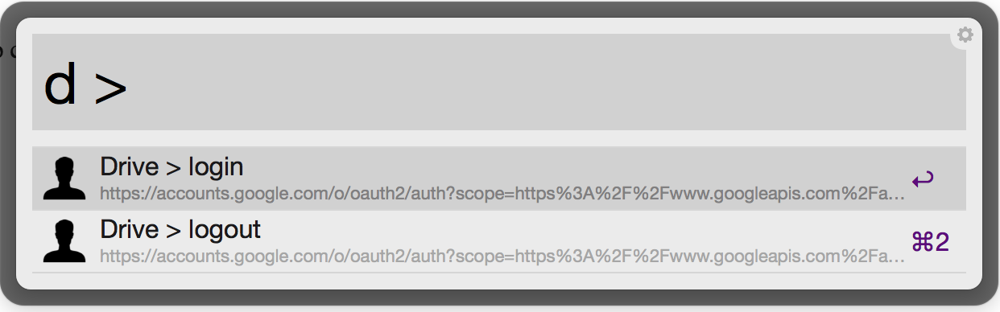
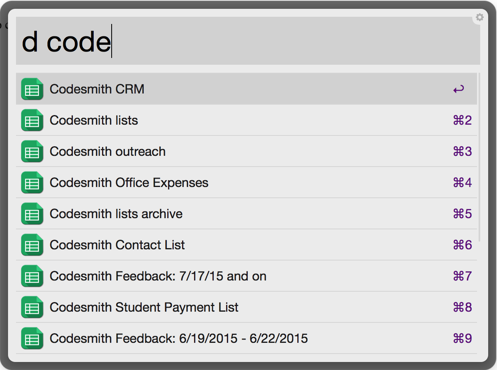

#Google Drive Workflow for [Alfred 2](http://www.alfredapp.com/)
This workflow searched your google drive and opens the files in your browser. They keyword is "d" (example ```d alfred```).

With ```enter``` you can open the entry in your default browser.

[Download](https://github.com/azai91/alfred-drive-workflow/releases)




##Getting started

You have to login (```d > login```) before you can use the workflow. The login uses OAuth, so you do not need to enter your credentials.

##Commands
- ```d {query}```
- ```d > login```
- ```d > logout```
- ```d > clear cache```
- ```d > set cache [seconds]```


###Please leave issues if you encounter any problems or star this repo if you found it useful :)
