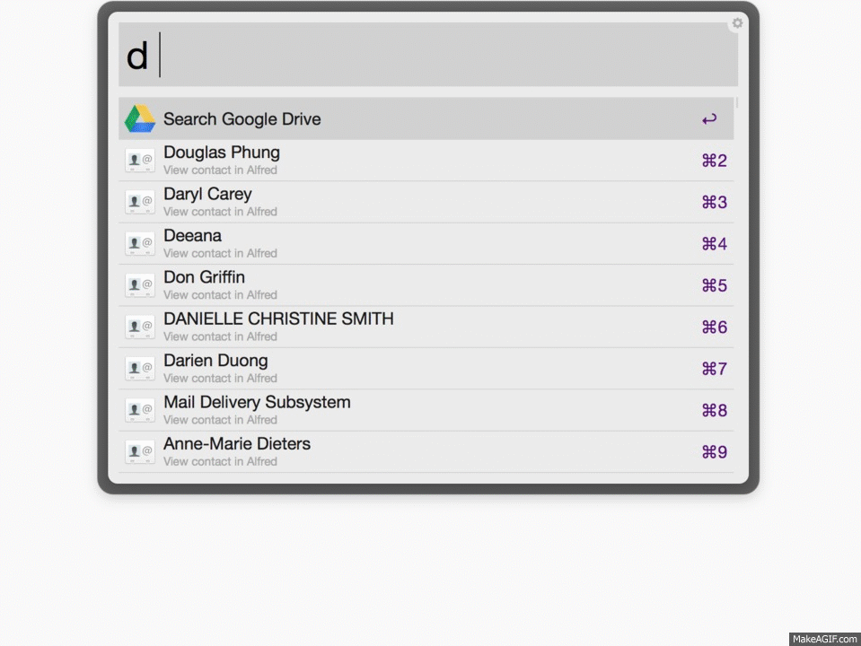

# Google Drive Workflow for [Alfred](http://www.alfredapp.com/)
This workflow searched your google drive and opens the files in your browser. They keyword is "d" (example ```d alfred```).

With ```enter``` you can open the entry in your default browser.

With ```CMD+C``` you can copy the link to your clipboard.

[Download](http://www.packal.org/workflow/alfred-drive-workflow)


## Getting started

You have to login (```d > login```) before you can use the workflow. The login uses OAuth, so you do not need to enter your credentials.



## Commands
- ```d {query}```
Searches your Google Drive for files that match that query. You can open the file in your default browser by selecting the file and hitting ```enter```

- ```d > login```
Links the workflow with your Google Drive Account. This option will redirect you to a Google Authentication page.

- ```d > logout```
Removes the current Google Drive Account from the workflow.

- ```d > clear cache```
Responses from Google Drive API are cached to increase the speed. Use this option if you want to clear the cache and make a fresh request.

- ```d > set cache [seconds]```
Sets the length of the duration for how long responses are held in cache before a fresh request is made. Default is 3600 seconds (1 hour)

- ```d > New Document```
Create Google Doc and opens in default browser

- ```d > New Spreadsheet```
Create Google Sheet and opens in default browser

- ```d > New Presentation```
Create Google Slide and opens in default browser

- ```d > New Form```
Create Google Form and opens in default browser

## Supported files types

- Google Docs
- Google Sheets
- Google Slides
- Google Forms
- PDFs

## To Develop

- Download repo with submodule
```
git clone --recursive https://github.com/azai91/alfred-drive-workflow
```

- Download submodule
```
git submodule update --init --recursive
```

Create Blank Workflow

Link `src` repo with workflow repo (find workflow repo by right clicking Google Drive workflow in Alfred Workflow and clicking `Open in Terminal/Finder`)

### Please leave issues if you encounter any problems or star this repo if you found it useful :)
